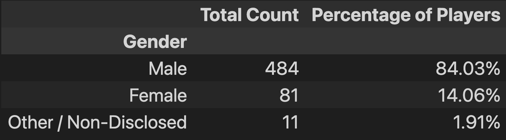
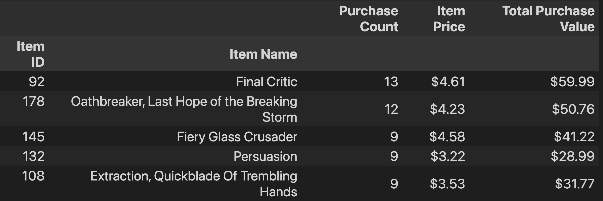
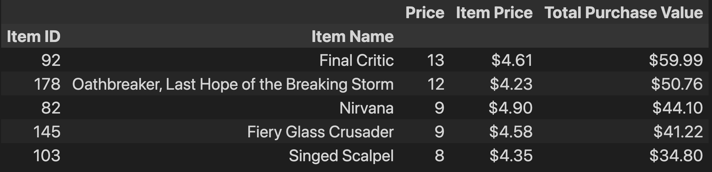

# Pandas Homework - Pandas, Pandas, Pandas

## Background

## Heroes of Pymoli

Congratulations! After a lot of hard work in the data munging mines, you've landed a job as Lead Analyst for an independent gaming company. You've been assigned the task of analysing the data for their most recent fantasy game Heroes of Pymoli.

Like many others in its genre, the game is free-to-play, but players are encouraged to purchase optional items that enhance their playing experience. As a first task, the company would like you to generate a report that breaks down the game's purchasing data into meaningful insights.

Your final report should include each of the following:

### Player Count

* Total Number of Players

### Purchasing Analysis (Total)

* Number of Unique Items
* Average Purchase Price
* Total Number of Purchases
* Total Revenue

### Gender Demographics

* Percentage and Count of Male Players
* Percentage and Count of Female Players
* Percentage and Count of Other / Non-Disclosed

### Purchasing Analysis (Gender)

* The below each broken by gender
  * Purchase Count
  * Average Purchase Price
  * Total Purchase Value
  * Average Purchase Total per Person by Gender

### Age Demographics

* The below each broken into bins of 4 years (i.e. &lt;10, 10-14, 15-19, etc.)
  * Purchase Count
  * Average Purchase Price
  * Total Purchase Value
  * Average Purchase Total per Person by Age Group

### Top Spenders

* Identify the the top 5 spenders in the game by total purchase value, then list (in a table):
  * SN
  * Purchase Count
  * Average Purchase Price
  * Total Purchase Value

### Most Popular Items

* Identify the 5 most popular items by purchase count, then list (in a table):
  * Item ID
  * Item Name
  * Purchase Count
  * Item Price
  * Total Purchase Value

### Most Profitable Items

* Identify the 5 most profitable items by total purchase value, then list (in a table):
  * Item ID
  * Item Name
  * Purchase Count
  * Item Price
  * Total Purchase Value

As final considerations:

* You must use the Pandas Library and the Jupyter Notebook.

### Copyright

© 2021 Trilogy Education Services, LLC, a 2U, Inc. brand. Confidential and Proprietary. All Rights Reserved.

## **Summary**:

The data is file is kept in the folder *Resources*.

## **Languages used**:
- Python

## **Python Packages Used**:
- Pandas

  
## **Conclusions**
#### **Gender analysis**
  From the analysis of the gen### Profitable Items Analysis
The item 'Final Critic' was bought the most (13 times) and had the highest price out of the top 5 most purchased items. This item also had the highest total purchase value, making it the most popular and profitable item.Non-disclosed (1.91%). Males as a group spent the most money (\\$1,967.64) on the game, but this could also be because there were approximatley 6 times more male purchases than female purchase and and about 43 times more than other/non-disclosed purchases.

Although males spent the most in total, they were the lowest group in regards to average purchase price (\\$3.20) and average total purchase per person (\\$4.07). This means that on average males bought cheaper items than compared to the other two groups, with female and other/ non-dislcosed buying more expensive items than what males appeared to buy (the average purchase prices being (\\$3.20 and \\$3.35 respectivley). Comparing average total purchase prices per person shows us that a male player spends less in total on items in the game than compared to the other two groups, with once again a player of gender other/non-dislcosed spending the most.

#### **Age Analysis**
  Majority of players were aged between 20 and 24 with 44.79% of players being within this age bracket. Players age 40+ were in the lowest percentage (2.08%) followed closely by the age bracket <10 (2.85%).

  Players in the age bracket of 20-24 spent the most in total (\\$1,114.06), with players aged 40+ spending the least in total. Players aged 35 to 39 had the highest average purchase price (\\$3.60), suggesting that they bought items with higher prices. This was followed by players aged <10 (\\$3.35). The highest average purchase price per person was for the age bracket 35-39 (\\$4.76), this suggests that players aged 35-39 spent more on the game than the other age barckets.

  ### **Profitable Items Analysis**
  The item 'Final Critic' was bought the most (13 times) and had the highest price out of the top 5 most purchased items. This item also had the highest total purchase value, making it the most popular and profitable item.

## **Screenshots**
## **Purchase Analysis (Total)**
.png)
## **Gender_Demographics**

## **Purchasing Analysis (Age)**
.png)
## **Item Analysis**

## **Most Profitable Items**

## **Running the jupyter notebooks**
1. Before running any of the jupyter notebooks please install needed packages running the following code in the terminal.
         
        pip install pandas

Or run this code in the first Jupyter Notebook

        ! pip install --user pandas

2. Run the file *HeroesofPymoli.ipynb* 
